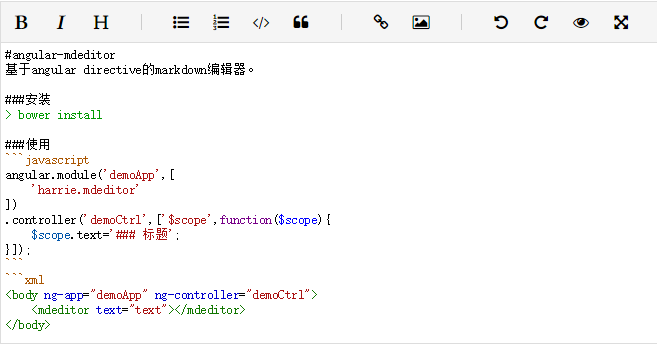

#angular-mdeditor
基于angular directive的markdown编辑器。



###安装
> bower install angular-mdeditor

###使用
```javascript
angular.module('demoApp',[
	'harrie.mdeditor'
])
.controller('demoCtrl',['$scope',function($scope){
	$scope.text='### 标题';
}]);
```
```xml
<body ng-app="demoApp" ng-controller="demoCtrl">
	<mdeditor text="text"></mdeditor>
</body>

```
###设置

- 工具栏
```javascript
$scope.toolbar=[
	{action:'bold',icon:'fa fa-bold',tip:'加粗(Ctrl+B)'},
	{action:'italic',icon:'fa fa-italic',tip:'斜体(Ctrl+I)'},
	{action:'header',icon:'fa fa-header',tip:'标题(Ctrl+H)'},
	{separator:true},
    {action:'ul',icon:'fa fa-list-ul',tip:'无序列表(Ctrl+U)'},
	{action:'ol',icon:'fa fa-list-ol',tip:'有序列表(Ctrl+O)'},
	{action:'code',icon:'fa fa-code',tip:'代码(Ctrl+K)'},
	{action:'quote',icon:'fa fa-quote-left',tip:'引用(Ctrl+Q)'},
    {separator:true},
	{action:'link',icon:'fa fa-link',tip:'连接(Ctrl+L)'},
	{action:'img',icon:'fa fa-picture-o',tip:'图片(Ctrl+G)'},
	{separator:true},
	{action:'undo',icon:'fa fa-undo',tip:'撤销'},
	{action:'redo',icon:'fa fa-repeat',tip:'重做'},
	{action:'preview',icon:'fa fa-eye',tip:'浏览'},
	{action:'fullscreen',icon:'fa fa-arrows-alt',tip:'全屏'}
];
```
```xml
<mdeditor text="text" toolbar='toolbar'></mdeditor>
```

- 主题
```xml
<mdeditor text="text" theme='default'></mdeditor>
```
可用主题请看[CodeMirror Theme](https://codemirror.net/demo/theme.html)

- 布局
```javascript
$scope.classNames={
	wrapper:'mdeditor',
	toolbar:'mdeditor-toolbar',
	toolbarItem:'mdeditor-toolbar-item',
	separator:'mdeditor-toolbar-separator',
	textarea:'mdeditor-textarea',
	preview:'mdeditor-preview'
};
```
```xml
<mdeditor text="text" class-names='classNames'></mdeditor>
```

- 快捷键
```javascript
$scope.shortcut:{
	'Ctrl-B':'bold',
	'Ctrl-I':'italic',
	'Ctrl-H':'header',
	'Ctrl-U':'ul',
	'Ctrl-O':'ol',
	'Ctrl-K':'code',
	'Ctrl-Q':'quote',
	'Ctrl-L':'link',
	'Ctrl-G':'img'
};
```
```xml
<mdeditor text="text" shortcut='shortcut'></mdeditor>
```